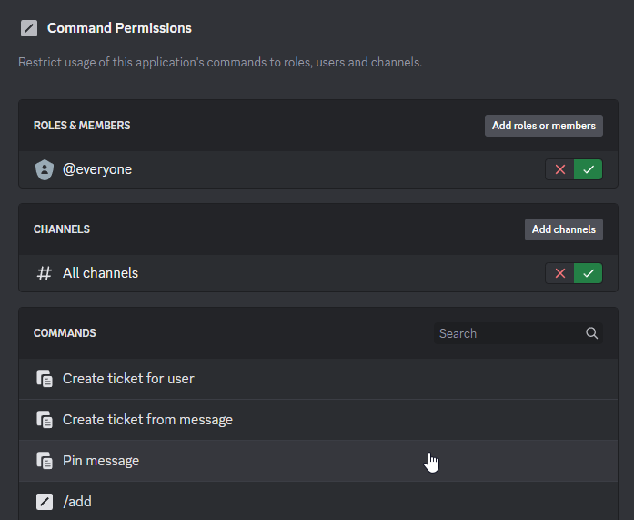

# Configuration

??? tip "If you're busy, you can get your bot configured for you with the configuration service"

	<stripe-pricing-table pricing-table-id="prctbl_1Me5XlEbl2jK6wYd5oNspN6J"publishable-key="pk_live_51MD8wcEbl2jK6wYdEgyQzlmV73jAIMRB41gZoesOe5B2zCEZHgGoZvG9YIxfX7TxPePre6szwFfIWJOLF4uWmILU00NoUviGyK" />

<!-- --8<-- "includes/features.md" -->

## Adding the bot to your guild

The first step is to log in to the settings panel, which is part of the Portal web application.

??? abstract "Public bot"
    The public portal is available at [portal.discordtickets.app](https://portal.discordtickets.app/settings).

    [Open the settings panel :octicons-link-external-16:](https://portal.discordtickets.app/settings){ target=_blank .md-button .md-button--primary }

??? abstract "Managed bot"
    Go to your subdomain or custom domain followed by `/settings` (e.g. `https://tickets.example.com/settings`).
    If have forgotten your subdomain, run the `/help` command to get a link.

??? abstract "Self-hosted bot"
    The settings panel is located at `/settings` on the origin you set as the `HTTP_EXTERNAL` environment variable.
    You can get a link by typing `settings` in the bot's console.

After logging in, you should see a list of guilds that you have permission to manage.
Select the guild you want to add the bot to, then refresh the page after authorising the bot.
You can then navigate to the guild's settings page.

## Using the settings panel

Each section of the settings panel has a dedicated page in this documentation and it is recommended that you read through each page
(:material-fire:{ title="Tip" } you can press ++n++ to move to the next page).

## Common configurations

## Command permissions

Before you start configuring the bot, you may want to clean up the application command selector for your members.

The bot will usually manage the overwrites on [staff-only commands](../features/commands.md) for you (so these commands are hidden from members),
but [ticket-only commands](../features/commands.md) are not modified by the bot.

This means that

- `Pin message`
- `/claim`*
- `/close`
- `/move`*
- `/priority`*
- `/release`*
- `/topic`
- `/transfer`

will be visible in every channel (although commands marked with * will only be visible to staff), despite the fact they can only be used in ticket channels.

To hide these commands, go to your `Server Settings` (in Discord), then go to the `Integrations` page and select the bot.

Keep the default as enabled in "All channels".

Click on each of the commands listed above and add all of your channels, disabling the command in each channel.

This will allow members to use commands such as `/new` and `/transcript` in any channel,
whilst commands such as `/close` and `/topic` won't be visible in most channels.
