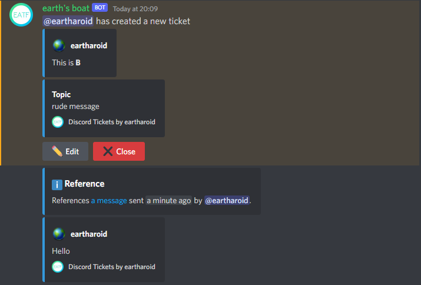

# Commands

!!! info "Symbols"
	:material-asterisk:{ .pink title="Required" } denotes a required option

	:material-headset:{ .orange title="Staff-only" } denotes a staff-only command or option

	:material-ticket:{ .blue title="Tickets-only" } denotes a command or option that can only be used within tickets

	:material-comment-text:{ .tip title="Autocompleted" } denotes a dynamic option that uses autocomplete


The command names, options, and choices on this page are in their original (English) form,
but you may see them translated in your Discord client. 

## Context menu commands

### Messages

#### `Create a ticket from message`

Create a ticket with reference to the target message.
This can be used for reporting messages (and their senders).

??? example
	**Result:**

	

#### :material-ticket:{ .blue title="Tickets-only" } `Pin message`

Allows members that don't have manage messages permission to pin messages in their own tickets.
Pinned messages can be easily found later in archives. 

### Users

#### :material-headset:{ .orange title="Staff-only" } `Create a ticket for user`

Send a prompt (in the channel the command is used in) for the target user to create a ticket by clicking a button.
If you have multiple [categories](./index.md#concept:categories) configured,
the staff member will be asked to select the category that the ticket will be created in.

This can be used as an alternative to repeatedly asking members to "please create a ticket with [`/new`](#new)". 

<!-- TODO: add screenshot -->

## Chat (slash) commands

### `/add`

Add a member to either a specific ticket or the ticket channel the command is used in.  

#### Options

|                                  Name                                  |                            Description                            |    Example    |
| :--------------------------------------------------------------------: | :---------------------------------------------------------------: | :-----------: |
|         :material-asterisk:{ .pink title="Required" } `member`         |                  The member to add to the ticket                  | `@eartharoid` |
| :material-comment-text:{ .tip title="Autocompleted" } `ticket` | The ticket to add the member to (defaults to the current channel) |      N/A      |

??? example
	Add the mentioned member to the ticket that the command is used in:
	``` title="Example 1"
	/add member: @eartharoid
	```
	---
	Add the mentioned member to the specified ticket:
	``` title="Example 2"
	/add member: @eartharoid ticket: 91
	```

### :material-ticket:{ .blue title="Tickets-only" } `/priority`

Add an emoji before the channel name to declare the ticket's priority.

#### Options

|                           Name                           |       Description       |          Example           |
| :------------------------------------------------------: | :---------------------: | :------------------------: |
| :material-asterisk:{ .pink title="Required" } `priority` | The new ticket priority | [See choices](#priority_1) |

##### Choices

##### `priority`

- `🔴 High`
- `🟠 Medium`
- `🟢 Low`

### :material-ticket:{ .blue title="Tickets-only" } `/transfer`

Transfer ticket to another specific user

#### Options

|                         Name                           |              Description           |       Example        |
| :----------------------------------------------------: | :--------------------------------: | :------------------: |
| :material-asterisk:{ .pink title="Required" } `user`   | The user to transfer the ticket to |     `@eartharoid`    |

??? example
	Transfer the ticket to the mentioned user:
	``` title="Example"
	/transfer user: @eartharoid
	```

### `/remove`

Remove a member from either a specific ticket or the ticket channel the command is used in.  

#### Options

|                                  Name                                  |                              Description                               |    Example    |
| :--------------------------------------------------------------------: | :--------------------------------------------------------------------: | :-----------: |
|         :material-asterisk:{ .pink title="Required" } `member`         |                   The member to remove to the ticket                   | `@eartharoid` |
| :material-comment-text:{ .tip title="Autocompleted" } `ticket` | The ticket to remove the member from (defaults to the current channel) |      N/A      |

??? example
	Remove the mentioned member from the ticket that the command is used in:
	``` title="Example 1"
	/remove member: @eartharoid
	```
	---
	Remove the mentioned member from the specified ticket:
	``` title="Example 2"
	/remove member: @eartharoid ticket: 91
	```

### `/claim`

Allows a staff member to take ownership of the ticket in order to process it 


### `/close`

Send a request to close the opened ticket. This can be done either by this command, or by the close button on the first ticket's message, if buttons are enabled. Only the staff can validate the ticket closure

#### Options

|                                  Name                                  |                              Description                               |    Example    |
| :--------------------------------------------------------------------: | :--------------------------------------------------------------------: | :-----------: |
|      :material-comment-text:{ .tip title="Autocompleted" } `reason`    |               The reason why the ticket should be closed               |      N/A      |
