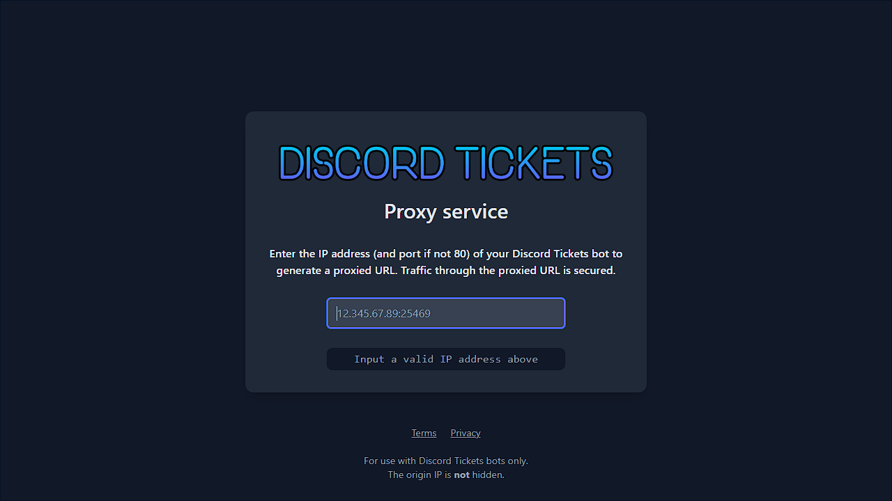

# Reverse proxy setup

If you want to [install the Portal](portal.md), your bot('s API) needs to have [SSL/TLS encryption](https://www.cloudflare.com/en-gb/learning/ssl/what-is-ssl/).
As the bot does not use SSL/TLS certificates itself, you need to proxy the HTTP traffic through a web server that does.

!!! info annotate
	**If you choose to host the portal on [Netlify](https://www.netlify.com) (which is recommended),
	you can ignore this page as there is a built-in proxy.**
	Make sure you change the `_redirects` file to have the correct IP address and port for your bot:

	```
	/api/*  http://your.bot.ip:port/:splat(1)  200!
	```

	and remove the environment variable.
1.  Make sure you keep the `/:splat` on the end!

If you already have a domain and know how to create an HTTPS proxy, you can safely skip this page. 
If not, there are several options available:

|                     | Nginx + Let's Encrypt | Discord Tickets Proxy |                 Netlify                 |   PebbleHost    |
| :------------------ | :-------------------: | :-------------------: | :-------------------------------------: | :-------------: |
| Difficulty          | Moderate { .orange }  |    Easy { .green }    |            Easy {  .green }             | Easy { .green } |
| Requires a domain   |     :warning: Yes     |          No           |                   No                    |  :warning: Yes  |
| Bot installations   |   Docker/Standalone   |          All          |                   All                   | PebbleHost only |
| Portal installation |          Any          |          Any          | [Netlify](https://www.netlify.com) only |       Any       |

> If you are installing the Portal on Netlify, use the Netlify proxy.
> 
> If you are **not* using


## Nginx

!!! tip
	If your bot is running on a [supported port](https://developers.cloudflare.com/fundamentals/get-started/reference/network-ports/),
	you can use Cloudflare's Proxy and free SSL/TLS instead of making your own with Nginx + Let's Encrypt.

Here's an example Nginx configuration file:

<div class="annotate" markdown>

```nginx
server {
    listen 80;
    listen [::]:80;

    server_name tickets-api.example.com(1);

    location / {
        proxy_set_header X-Real-IP $remote_addr;
        proxy_set_header Host $host;
        proxy_set_header X-Forwarded-Host $host;
        proxy_set_header X-Forwarded-Port $server_port;
        proxy_set_header X-Forwarded-Proto $scheme;
        proxy_set_header X-Forwarded-For $proxy_add_x_forwarded_for;

        proxy_http_version 1.1;
        proxy_pass http://127.0.0.1:8080(2);
    }
}
```

</div>

1. Replace this with your FQDN
2. Change the port to match your bot's

**To add SSL/TLS, follow [this guide](https://www.digitalocean.com/community/tutorials/how-to-secure-nginx-with-let-s-encrypt-on-ubuntu-20-04).**

## Discord Tickets Proxy

[Terms of service](../terms.md) and [Privacy policy](../privacy.md) apply.

1. Go to [proxy.discordtickets.app](https://proxy.discordtickets.app) and paste your bot's IP address (and port).
2. Copy the URL given and use this in place of the original IP when you set up the Portal



## PebbleHost

<!-- TODO: add pebblehost proxy -->